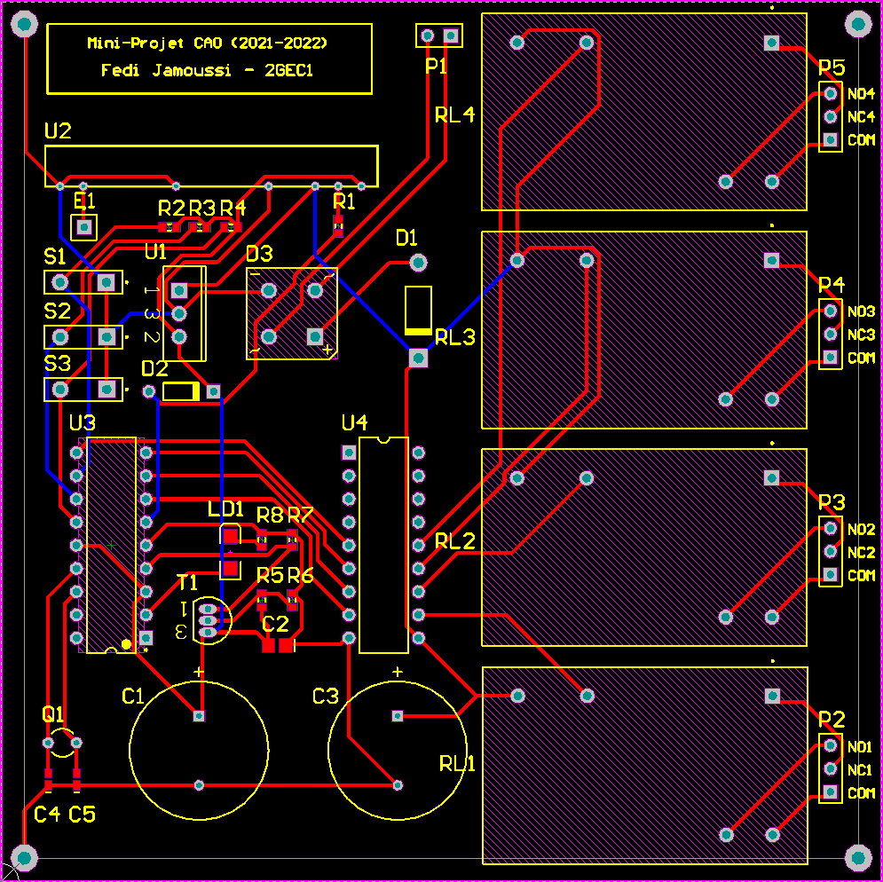
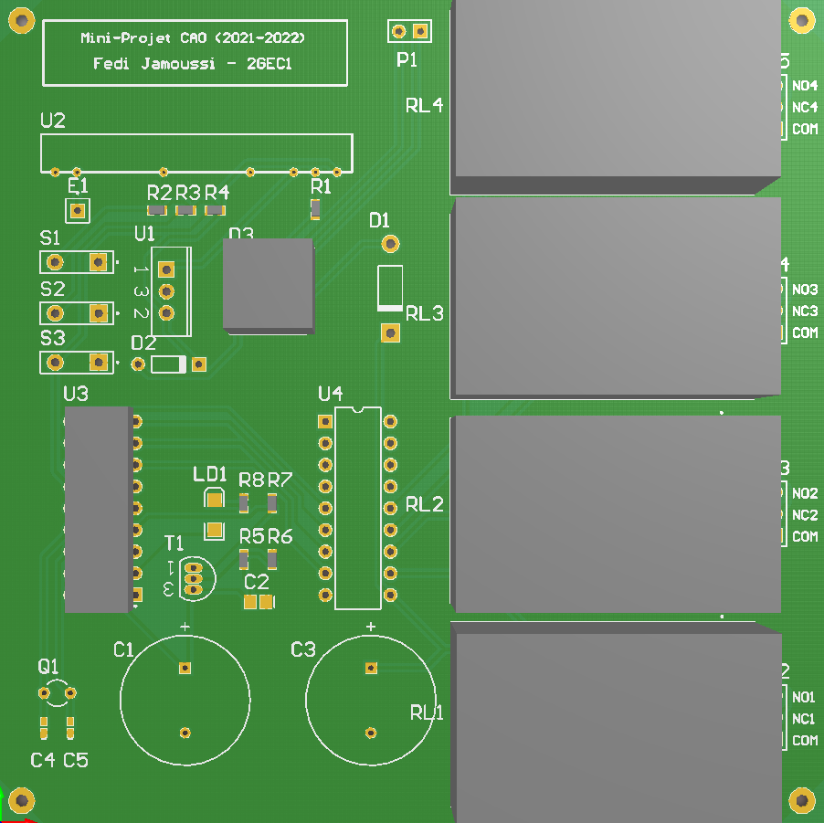
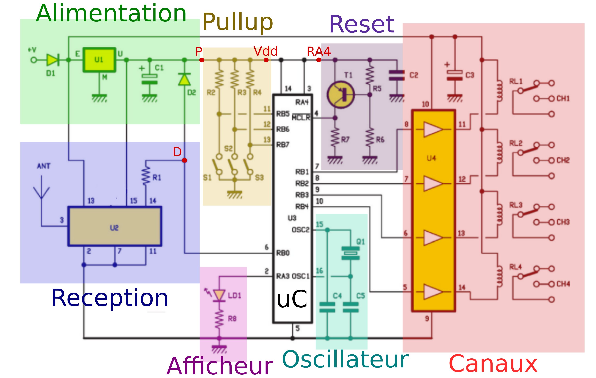
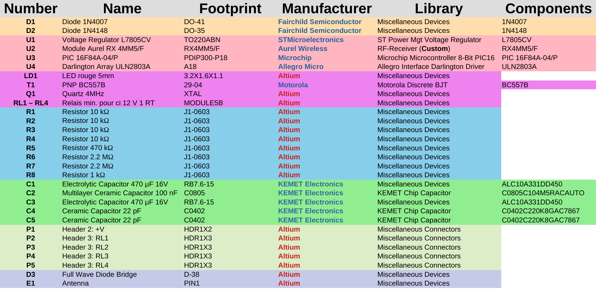

# Description
Full PCB Design of a four-channel Remote Control Receiver in Altium Designer. In order to make the design modular and easier to work with, I divided the general circuit into sub-circuits.

Next, I selected the components for each sub-circuit and even created a missing library (for the antenna) myself. The final sub-schematics can be found .

Finally, the routing was a mix between manual and automatic with a lot of modifications in between.

# Screenshots

	
	
	
	

